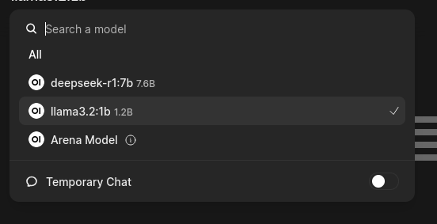
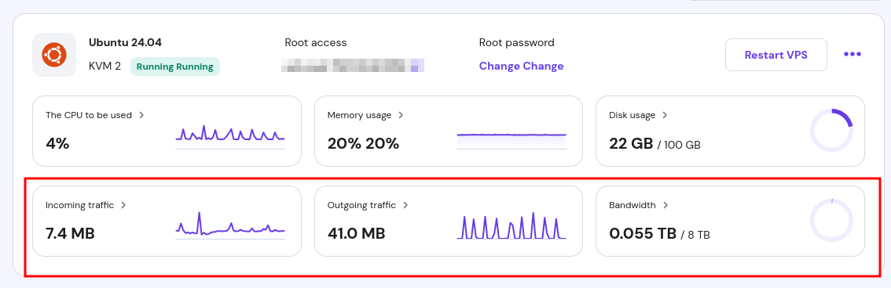

# Docker Compose Setup for Ollama and Open-WebUI
This setup uses Docker Compose to deploy two services: __Ollama__ and __Open-WebUI__. Below is a detailed explanation of each service and its configuation.

## Overview
The goal of this configuration is to efficiently run the __Ollama__ service using Docker, avoiding large disk space usage on the VPS, and turn the web app faster. 

## Services
__Key Configuration:__

- Image: The Ollama service uses the latest version from the GitHub Container Registry (ghcr.io/ollama/ollama:latest).
- Ports: Exposes port 11434 to allow communication between other services.
- Volumes: Mounts the local ./ollama directory to /root/.ollama inside the container. This keeps Ollama’s configuration and data on the host machine to avoid large data storage inside the container.
- Memory and CPU Limits: The container is limited to 4 GB of memory and 1.5 CPUs to optimize resource consumption.
- Restart Policy: The service will restart unless explicitly stopped, ensuring high availability.
- Network: The service is connected to the shared-network to allow communication with the Open-WebUI service.

__And other words, allows the application to be faster and more efficient.__

## Open-WebUI Service
- Image: Uses the latest open-webui image from the GitHub Container Registry (ghcr.io/open-webui/open-webui:main).
- Ports: Exposes port 8080 internally and maps it to port 3000 on the host machine.
- Environment Variables: The OLLAMA_BASE_URL environment variable is set to http://ollama:11434, which connects Open-WebUI to the Ollama service running in the other container.
- Extra Hosts: The extra_hosts field maps host.docker.internal:host-gateway to allow the Open-WebUI to communicate with the host machine if necessary.
- Volumes: Mounts the ./open-webui directory to /app/backend/data inside the container to store the application data on the host machine.
- Memory and CPU Limits: The container is limited to 1.5 GB of memory and 0.5 CPUs to prevent excessive resource consumption.
- Restart Policy: Like the Ollama service, Open-WebUI will restart unless explicitly stopped.
- Network: Both services share the same shared-network, enabling communication between them.

## How to use This Setup
__Running the Containers:__
To start the services, navigate to the directory where the `docker-compose.yml` file is located and run:
`docker-compose up -d`

This will build and run the containers in the background.

## Resource Optimization
By using Docker to run Ollama, we avoid large disk space usage on the VPS. Data is stored outside the container (in the `./ollama` and `./open-webui` directories) to minimize the impact on the host's file system.

*Memory and CPU Limits*
Both services are allocated reasonable amounts of resources to avoid overloading the system:

- Ollama: 4 GB of memory and 1.5 CPUs
- Open-WebUI: 1.5 GB of memory and 0.5 CPUs

This ensures that each service has enough resources to run efficiently while preserving the overall performance of your VPS.

## Problems

## Results
